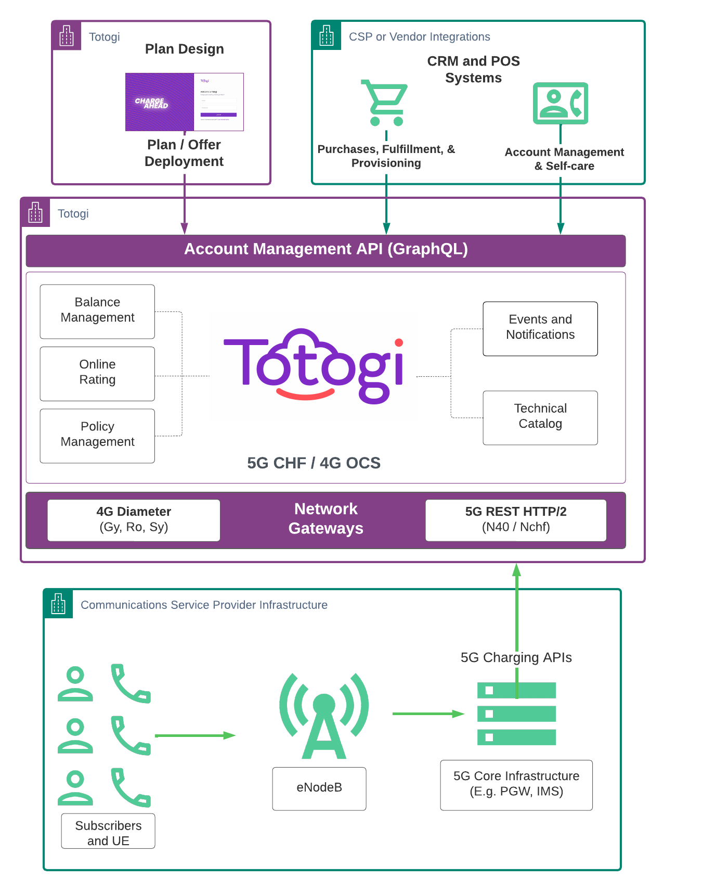
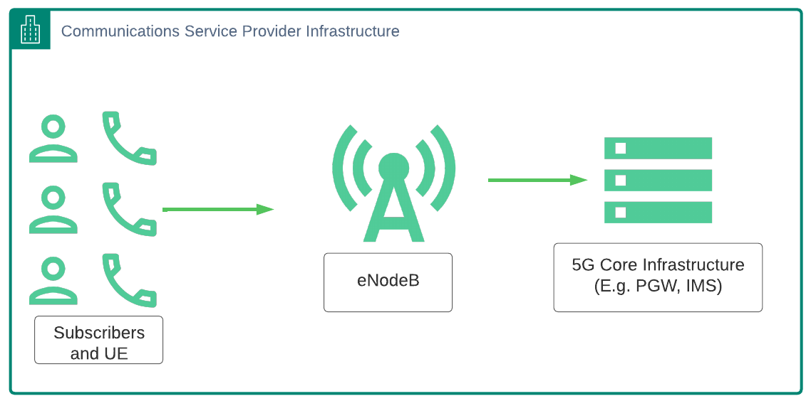
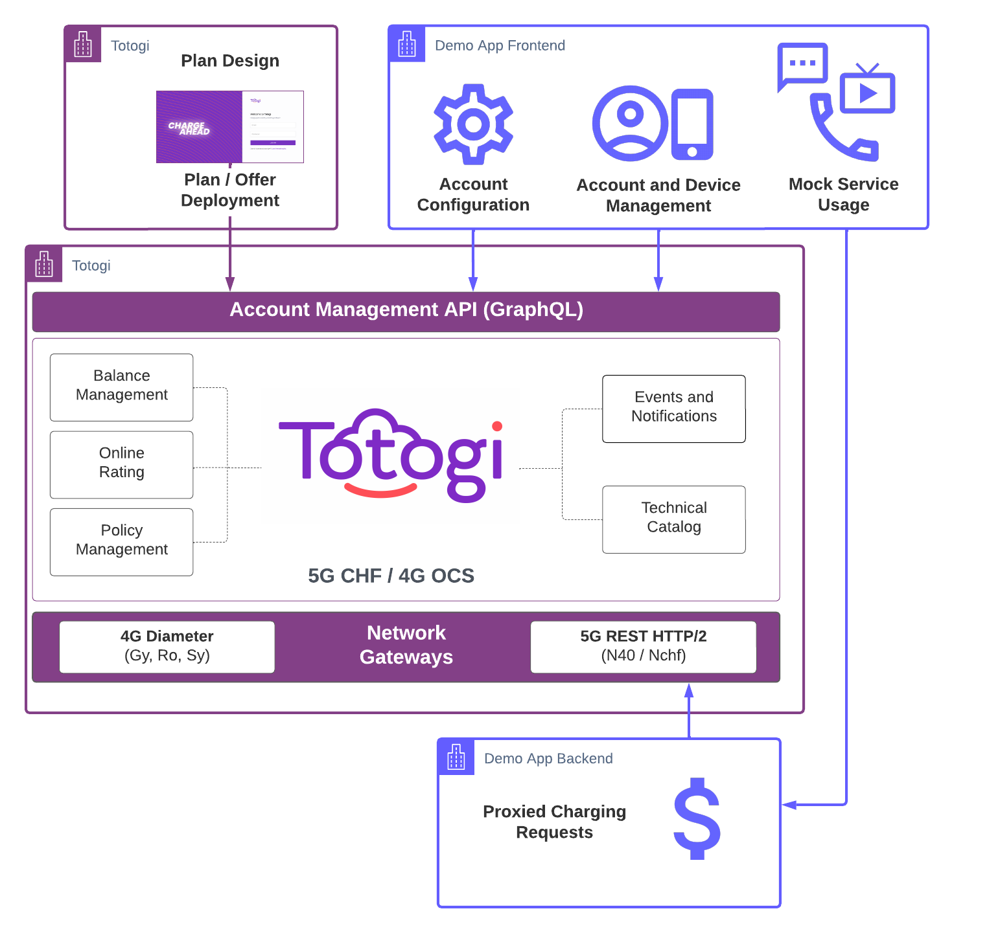
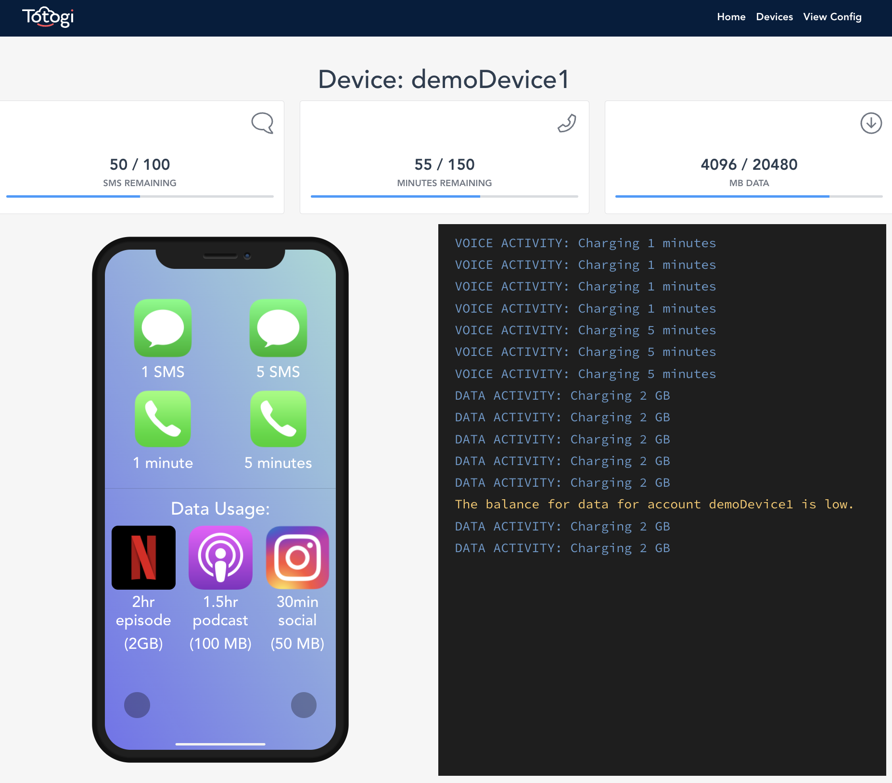
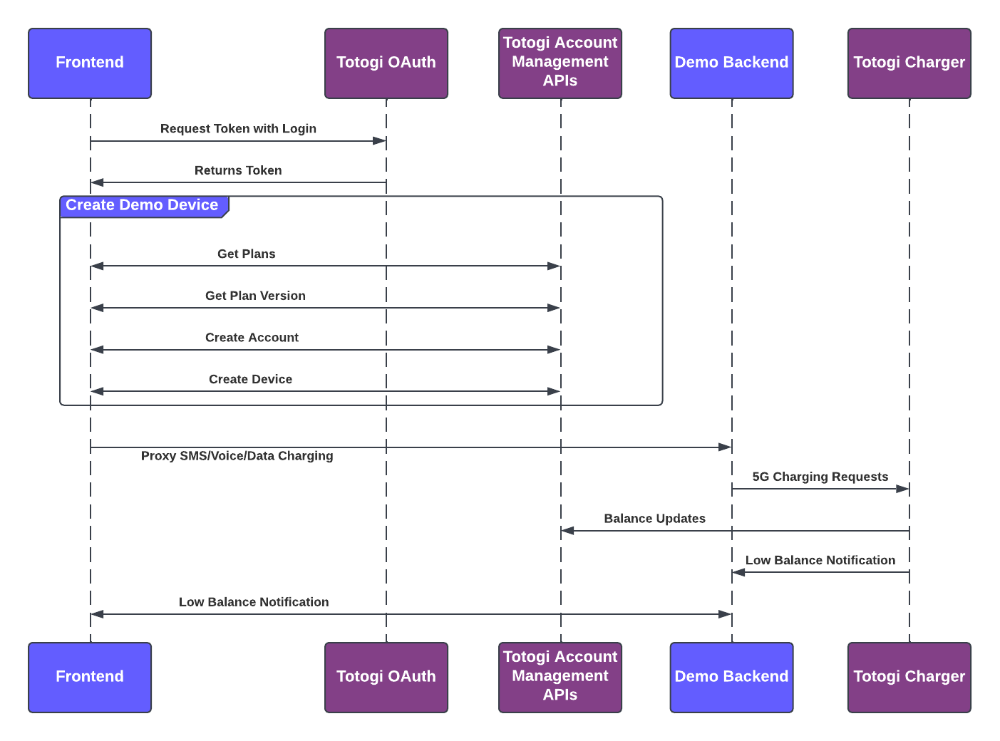
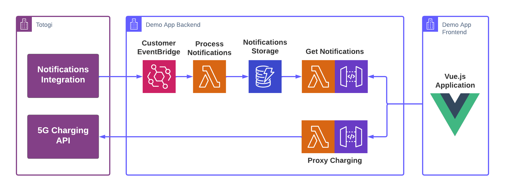
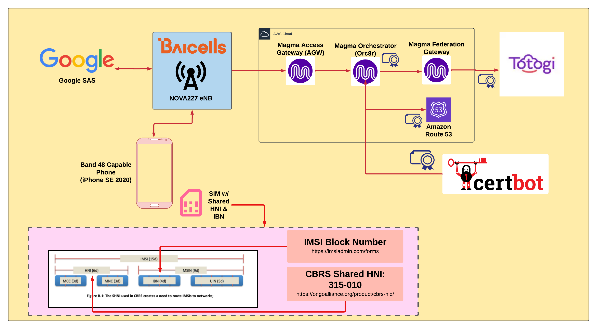

# Build a charging emulator using Totogi APIs

One of Totogi’s core products is a [planet-scale cloud charger](https://www.totogi.com/products/charging-system/) for communications service providers, also known as telcos or CSPs. CSPs can use Totogi’s Charging System to collect billing data and usage information from their subscribers using their core networks.

In this blog post, we'll show how to build a basic mobile phone emulator that generates 5G 3GPP charging requests to the [Totogi Charging System](https://www.totogi.com/products/charging-system/), using Totogi APIs to incorporate the charger into existing BSS applications:

- The [Totogi Account Management APIs](http://apis.totogi.solutions/ccab/) interact with subscriber accounts and devices
- The [5G HTTP charging APIs](https://www.3gpp.org/ftp/Specs/archive/32_series/32.291/) creates account charges
- [Totogi Notifications system]() creates real-time account balance notifications
- [Totogi Plan Design](https://support.ccab.totogi.com/hc/en-us/sections/4418061841554-Plan-UI) creates plans

We'll take a close look at how we built the frontend and backend of our [demo application](https://github.com/totogi/totogi.demoing.tool), and how it integrates with Totogi:



In this process, we'll be abstracting away the components of the typical CSP infrastructure, such as actual subscribers and User Equipment, the core network components eNodeBs, Packet Gateways, IP Multimedia Systems, and few dozen other components not pictured below depending on the implementation and generation of the CSP core network:



Instead, we'll be using a frontend application that interacts directly with the Totogi APIs to configure the correct Totogi demo account, create, manage demo accounts and devices, and mock the usage of services like SMS, voice, and data:



While the frontend can use *most* of the [Totogi APIs](http://apis.totogi.solutions/ccab/) (all of the GraphQL APIs that are designed to be consumed from web interfaces) we need one backend component to proxy the mocked charging requests.

This is because the Totogi Charger is designed to be used as a machine-to-machine API and to receive information from the local CSP infrastructure like a Packet Gateway. In fact, the charger actually supports multiple methods of receiving network traffic: both a 4G Diameter interface and a [5G N40 API](https://jdegre.github.io/editor/?url%3Dhttps://raw.githubusercontent.com/jdegre/5GC_APIs/master/TS32291_Nchf_ConvergedCharging.yaml&sa=D&source=docs&ust=1654117169671624&usg=AOvVaw3HOB3NI9RJ_e9EL4b-MMUK). In this example, we'll be using the **5G REST HTTP/2 N40 API**.

## The frontend demo application for the Totogi Charging Emulator

The Totogi Charging Emulator is a frontend web application that emulates a subscriber using their mobile phone. The emulator makes it simple to simulate different types of usage and to visualize the impact on balances and notifications. It accesses several of the Totogi Account Management APIs to do things like load plan and plan version details, determine initial balances, and create and manage new devices in the system that we want to demo with. 

Most of this happens behind the scenes and leaves us with a very simple UI that allows us to simulate the most basic components of a subscriber plan:

- SMS
- voice
- data



Above is an example of a demo device view. 

In this, we see the current balances for that device at the top. These are updated regularly by polling one of the Totogi Account Management APIs.

On the left side, we have a mocked phone that can simulate these different charging interactions by sending requests to a backend proxy that sends them to the Totogi 5G Charging API.

On the right side, we have a running log of all the charging interactions to compare against as well as low-balance notifications from the Totogi notification system. These are automatic notifications that CSPs may subscribe to in order to process events like low-balance notifications, plan expiration, and new subscriptions. The power of this sort of subscription enables everything from automated top-up reminders to lifecycle management processing. 

Let's take a look at this in more detail:



Access to all of Totogi’s APIs is limited to authorized [OAuth 2.0](https://oauth.net/2/) tokens to use them. The frontend starts by making a request to the Totogi OAuth endpoint to retrieve tokens from signing in.

Next, it makes a series of requests to Totogi Account Management APIs to find the most recently published plan and creates a subscriber account and demo device associated with the latest plan.

After this, it uses the UI shown earlier to send various requests for SMS, Voice, and Data charging requests to a custom backend API. In a standard implementation, this step would go directly to the Totogi charger from the packet gateway (PGW). Since the Totogi charger API is not designed to be called from web applications (it does not enable CORS), our browser-based application needs to send a request to a proxy API that can emulate a PGW.

That proxy API takes a few parameters from the frontend request including:

- device ID
- type of charging request to make (e.g. sms, voice, data)
- volume associated with the request (5 messages/minutes, 2GB data etc.)

After making the request, the frontend continues to monitor the Totogi Account Management APIs to review the balances for the demo device and update the page accordingly. 

It also polls the backend for recently received low-balance notifications and displays them in the right-hand log window.

## The backend application for the Totogi Charging Emulator

Now let's see how we built the backend application for the Totogi Charging Emulator, and how it interacts with the Totogi APIs as seen in the above sequence diagram. Our backend application handles several different needs:

1. processing and storing notifications from Totogi
2. providing an API to get saved notifications for different devices
3. proxying 5G Charging requests for the frontend



To handle these needs, our application is a [Serverless Framework](https://www.serverless.com/) application in AWS that creates AWS resources like Lambda Functions, API Gateway endpoints, a DynamoDB Table and an integration with an EventBridge Bus that receives our Totogi Notifications for processing. This application is in the `backend` folder of our demo code.

Here's how it works:

**`serverless.yml`**

With any Serverless Framework application, the core configuration is inside the `serverless.yml` file. For us, this starts with configuring a few basics including a service name, framework version, AWS region, and the runtime language and version to use. 

```yml
service: totogi-demoing-tool
frameworkVersion: '3'

provider:
  name: aws
  region: us-west-2
  profile: igotot-wireless
  runtime: python3.8
  environment:
    DYNAMODB_TABLE: notifications-${sls:stage}
  httpApi:
    cors: true
  iam:
    role:
      statements:
        - Effect: Allow
          Action:
            - dynamodb:Query
            - dynamodb:PutItem
          Resource:
            - "arn:aws:dynamodb:${aws:region}:*:table/${self:provider.environment.DYNAMODB_TABLE}"
```

We also specify an environment variable for the DynamoDB table name that will be `notifications-dev` or `notifications-prod` depending on the stage we're deploying to.

After that, we configure Cross-Origin Resource Sharing for our HTTP API so that we can use it from our browser app. We also set up the Identity and Access Management permissions our service should have access to. In this case, only Query and PutItem operations on our DynamoDB table.

After all of this we specify the different Lambda Functions and the events that will be triggering them:

```yml
functions:
  proxyCharging:
    handler: src/proxy.handler
    events:
      - httpApi:
          path: /
          method: post
  getNotifications:
    handler: src/notifications.handler
    events:
      - httpApi:
          path: /notifications
          method: get
  processNotifications:
    handler: src/eventbridge.process
    events:
      - eventBridge:
          eventBus: arn:aws:events:us-west-2:192911284903:event-bus/EB-Totogi-igototwireless
          pattern:
           account:
             - "266643203619"
```

This includes the `proxyCharging` API endpoint to create 5G charging requests and the `getNotifications` endpoint so that our application can fetch any notifications that were sent in from Totogi and then stored by our `processNotifications` function.

The `processNotifications` function is configured to process all the events going into our EventBridge that are arriving from the `266643203619` account (where Totogi sends in events from). The process of creating an Amazon EventBridge and configuring it to work with Totogi is outside of the scope of this post, but it's a very quick process for any of our customers.

The last portion of the configuration references a file where we describe our DynamoDB infrastructure along with details to help manage Python dependencies and service packaging:

```yml
resources:
  - ${file(resources/dynamodb.yml)}

plugins:
  - serverless-python-requirements

custom:
  pythonRequirements:
    dockerizePip: true

package:
  patterns:
    - '!venv/**'
    - '!node_modules/**'
```

**`resources/dynamodb.yml`**

The DynamoDB table used by the application to store notifications data has a partition key (`pk`) and sort key (`sk`). We are using the [single table design](https://www.alexdebrie.com/posts/dynamodb-single-table/) pattern, and our keys are prefixed with the object type stored in each row.

```yml
Resources:
  notificationsTable:
    Type: AWS::DynamoDB::Table
    Properties:
      TableName: ${self:provider.environment.DYNAMODB_TABLE}
      AttributeDefinitions:
        - AttributeName: pk
          AttributeType: S
        - AttributeName: sk
          AttributeType: S
      KeySchema:
        - AttributeName: pk
          KeyType: HASH
        - AttributeName: sk
          KeyType: RANGE
      ProvisionedThroughput:
        ReadCapacityUnits: 1
        WriteCapacityUnits: 1
```

With all this infrastructure configured we can look at some of the application code.

**Processing Totogi Notifications**

When processing notifications our EventBridge Bus has a Rule configured that sends event payloads to Lambda. Here's what an example event looks like notifying us that the voice balance for a subscriber account was `normal` but is now `low`:

```py
{'account': '<REDACTED>',
 'detail': {'account': 'subscriberAccountTest1',
            'counter': 'AllowanceThresholdVoice',
            'custom': '{}',
            'day': '30',
            'device': 'subscriberDeviceTest1',
            'month': '5',
            'pk': 'EVT#<REDACTED>#subscriberDeviceTest1',
            'prevState': 'normal',
            'provider': '<REDACTED>',
            'session': '<REDACTED>',
            'sk': 1653944105731336000,
            'state': 'low',
            'threshold': 600,
            'ttl': 1654030505,
            'year': '2022'},
 'detail-type': 'CounterThreshold',
 'id': '<REDACTED>',
 'region': 'us-east-1',
 'resources': [],
 'source': 'threshold-events-handler',
 'time': '2022-05-30T20:55:06Z',
 'version': '0'}
```

What constitutes a "low" balance? That's completely configurable in our Plan Design UI! Right now, it means dropping below 50% of the allocated balance. We have notifications for any kind of low balance: voice, text, and data. We also have even more notifications CSP software teams can use such as when a subscriber is created or activated.

Process these events to send out low-balance warnings to subscribers, handle lifecycle workflows, manage marketing campaigns, and much more!

In our application however, all we're doing is storing notifications for low balances that can easily be queried for in DynamoDB based on the device we're working with. This is as simple as importing a few dependencies and configuring our DynamoDB table resource:

```py
import os
import boto3
from datetime import datetime

DYNAMODB_TABLE = os.environ['DYNAMODB_TABLE']

dynamodb = boto3.resource('dynamodb')
table = dynamodb.Table(DYNAMODB_TABLE)
```

And then checking if the event is a threshold event and handling it accordingly:

```py
def process(event, context):
    print("Event: " + str(event))
    if event_is_threshold(event):
        handle_threshold(event)
```

To check if the event is a newly breached threshold, we look for a current state of `low` (because Totogi also provides notifications when a threshold goes from low back to normal) and that the counter contains the text `AllowanceThreshold`:

```py
def event_is_threshold(event) -> bool:
    detail = event.get('detail', {})
    counter_type = detail.get('counter', '')
    state = detail.get('state', '')
    if 'AllowanceThreshold' in counter_type and state == 'low':
        return True
    return False
```

To handle the threshold, we determine which kind of threshold it is:

```py
def handle_threshold(threshold_event):
    provider_id: str = threshold_event['detail']['provider']
    account_id: str = threshold_event['detail']['account']
    counter_type: str = threshold_event['detail']['counter']
    
    if counter_type == 'AllowanceThresholdVoice':
        record_notification('voice', account_id, provider_id)
    if counter_type == 'AllowanceThresholdText':
        record_notification('text', account_id, provider_id)
    if counter_type == 'AllowanceThresholdData':
        record_notification('data', account_id, provider_id)
```

And save the data to DynamoDB:

```py
def record_notification(threshold_type: str, account: str, provider: str):
    print('Recording notification for ' + threshold_type + ' for account ' + account)
    message = f'NOTIFICATION: The  {threshold_type} balance is low.'
    now_timestamp = datetime.now().isoformat()[:-4]+'Z'
    item = {
        'pk': f'PROVIDER#{provider}#ACCOUNT#{account}',
        'sk': 'TYPE#THRESHOLD#TIMESTAMP#' + now_timestamp,
        'message': message,
        'thresholdType': threshold_type,
        'timestamp': now_timestamp
    }
    table.put_item(Item=item)
```

**Getting Totogi Notifications**

Getting back the relevant notifications for our accounts after we've stored them in our backend is even simpler.

We setup some dependencies and our DynamoDB Table resource:
```py
import json
import os
import boto3
from boto3.dynamodb.conditions import Key

DYNAMODB_TABLE = os.environ['DYNAMODB_TABLE']
dynamodb = boto3.resource('dynamodb')
table = dynamodb.Table(DYNAMODB_TABLE)
```

Then we run a query on the table using the query string parameters from the incoming GET request event:

```py
def handler(event, context):
    print(event)
    provider_id: str = event['queryStringParameters']['providerId']
    account_device_id: str = event['queryStringParameters']['deviceId']
    pk = Key('pk').eq(f'PROVIDER#{provider_id}#ACCOUNT#{account_device_id}')
    sk = Key('sk').begins_with('TYPE#THRESHOLD#')
    expression = pk & sk
    items = table.query(
        KeyConditionExpression=expression
    )['Items']
    return {
        'statusCode': 200,
        'body': json.dumps({
            'items': items
        })
    }
```

This returns all the relevant notifications we're looking for and we can display them within the frontend.

**The 5G Charging Proxy**

The final purpose for our backend application is to proxy requests from the frontend and turn them into 5G charging API requests. This is done on the backend for two reasons:

1. 5G requests cannot be made directly from a browser due to CORS restrictions on the 5G API
2. 5G API requires HTTP2 and most frontend clients do not currently do not support this without additional configuration (Axios, fetch etc.)

This entire process would *usually* be handled by a local on-premises application, most likely as a component of the PGW. But because we're mimicking the network traffic we need our own application to handle this for us.

Our frontend UI offers a few structured options for charging requests: voice, SMS, and data consumption. But the backend translates this simple request into a full 5G charging message. Normally in the process of an ongoing phone conversation in a 5G context we would have a series of charging requests like this:

- The `init` request reserving an initial balance of minutes
- An `update` request reserving any additional minutes and recording any minutes used so far
- Any additional `update` requests for the duration of the call as it continues using the service over time
- A `terminate` request that completes the reservation and re-allocates any unused minutes.

But for this demo, we'll do these all at once and in sequence in order to charge precisely what the demo app would like us to.

If we want to charge 5 minutes of voice we send an `init` request reserving 5 minutes, then send an `update` request using 5 minutes and reserving no additional time, and a final `terminate` request ending the session and neither reserving or using any time. At this point the account balance would be updated.

Here's what this looks like in practice. We create the data for the `init`, `update`, and `terminate` requests in a very similar way by including the `providerId`, `deviceId`, `volume` and `ratingGroupNumber` (corresponding to voice, text, or data in this case). We also have a `unitTypeIdentifier` utility function to pick the type of unit we might need when charging voice minutes (`time`), SMS or money (`serviceSpecificUnits`), data (`totalVolume`), or other custom rating groups. And we have some faked `locationReportingChargingInformation` information and an auto-generated timestamp:

```py
def init_data(providerId: str, deviceId: str, volume: int, ratingGroupNumber: int):
    UNIT_TYPE = unitTypeIdentifier(ratingGroupNumber)
    return {
        "invocationSequenceNumber": 1,
        "tenantIdentifier": providerId,
        "subscriberIdentifier": deviceId,
        "multipleUnitUsage": [
        {
            "requestedUnit": {
                UNIT_TYPE: volume
            },
            "usedUnitContainer": [
            {
                "localSequenceNumber": 1,
                UNIT_TYPE: 0
            }
            ],
            "ratingGroup": ratingGroupNumber
        }
        ],
        "locationReportingChargingInformation": {
            "pSCellInformation": {
                "nrcgi": {
                    "nrCellId": '11',
                    "nid": '12',
                    "plmnId": {
                        "mcc": '310',
                        "mnc": '170'
                    }
                }
            }
        },
        "nfConsumerIdentification": {
            "nodeFunctionality": 'SMF'
        },
        "invocationTimeStamp": iso_utc_now()
    }
```

The `update` request data has an incremented sequence number, and records the units used:

```py
def update_data(providerId: str, deviceId: str, volume: int, ratingGroupNumber: int):
    UNIT_TYPE = unitTypeIdentifier(ratingGroupNumber)
    return {
        "invocationSequenceNumber": 2,
        # ... omitted
        {
            "requestedUnit": {
                UNIT_TYPE: 0
            },
            "usedUnitContainer": [
            {
                "localSequenceNumber": 1,
                UNIT_TYPE: volume
            }
            ],
            # omitted
        } 
    }
```

And the `terminate` data simply closes things out without using or requesting any additional volume for the request:

```py
def terminate_data(providerId: str, deviceId: str, volume: int, ratingGroupNumber: int):
    UNIT_TYPE = unitTypeIdentifier(ratingGroupNumber)
    return {
        "invocationSequenceNumber": 3,
        # omitted
        "multipleUnitUsage": [
        {
            "requestedUnit": {
                UNIT_TYPE: 0
            },
            "usedUnitContainer": [
            {
                "localSequenceNumber": 1,
                UNIT_TYPE: 0
            }
            ],
            "ratingGroup": ratingGroupNumber
        }
        ],
        # ... omitted
    }
```

The request data in these requests is sent into the Charging API via the Python HTTP client, `httpx`. The `httpx` client is HTTP2-compatible and makes sending these requests significantly easier than other common libraries like `requests` for Python or `Axios` for Node.js. Here's an example with the init request.

First we import the required libraries and utility functions:

```py
import json
import httpx

from src.utils import (
    init_url,
    update_url,
    terminate_url,
    init_data,
    update_data,
    terminate_data,
    headers,
)
```

The `*_data` functions are shown above. The `headers` contain required token information to secure the request, and the `*_url` functions help us create the [3GPP 5G NCHF URLs](https://www.etsi.org/deliver/etsi_ts/132200_132299/132291/16.06.01_60/ts_132291v160601p.pdf) we need to send requests to: this is because the URL for update and terminate requests must contain the session ID information from the init request.

Then we create the `httpx` client and functions to handle the three HTTP requests:
```
client = httpx.Client(http2=True)


def init_request(requestData, idToken) -> str:
    response = client.post(
        url=init_url(),
        json=requestData,
        headers=headers(idToken)
    )
    return response.headers['location']

def update_request(requestData, idToken: str, sessionId: str) -> None:
    client.post(
        url=update_url(sessionId),
        json=requestData,
        headers=headers(idToken)
    )

def terminate_request(requestData, idToken: str, sessionId: str) -> None:
    client.post(
        url=terminate_url(sessionId),
        json=requestData,
        headers=headers(idToken)
    )
```

With all of this set up, we chain it all together when the request comes in:

```py
def handler(event, context):
    body = json.loads(event['body'])
    providerId = body['providerId']
    deviceId = body['deviceId']
    volume = body['volume']
    ratingGroupNumber = body['ratingGroupNumber']
    idToken = body['token']
    initRequestData = init_data(providerId, deviceId, volume, ratingGroupNumber)
    sessionId = init_request(initRequestData, idToken)
    updateRequestData = update_data(providerId, deviceId, volume, ratingGroupNumber)
    update_request(updateRequestData, idToken, sessionId)
    terminateRequestData = terminate_data(providerId, deviceId, volume, ratingGroupNumber)
    terminate_request(terminateRequestData, idToken, sessionId)
    return {
        'statusCode': 200,
        'body': json.dumps({
            'message': 'Successfully executed'
        })
    }
```

When this process completes, the charges will be recorded in our account and the balances will be updated when our frontend queries for the account balances. Also, depending on those balances, this request might trigger a low balance notification.

## Demo in action

And that's the core of this project! Let's take a look at a full demo with this tool. We'll start by using the Totogi Plan Designer and then use this tool to try out our new plan!

Totogi Charging Emulator Introduction Video

## Get started today

Everything we've shown in this post and demo video is just the most basic functionality that our charger supports. We're getting ready to showcase all the other amazing features of our charging engine. Watch how easy it is to tackle things like:

- multi-level account hierarchies
- DPI Charging
- plan overrides for MVNO providers

And quite a bit more! If there's a particular demo you'd like to see us showcase, [book a demo today](https://www.totogi.com/products/charging-system/#book)

**Building our own network**

This is a great start at understanding the charging emulator you can build with Totogi APIs, but we aren't done yet. Right now, we're also working on creating an even more end-to-end demo experience. To do this, we are building our own mobile core network based on [Magma](https://www.magmacore.org/) and the [Citizens Broadband Radio Service](https://en.wikipedia.org/wiki/Citizens_Broadband_Radio_Service) in the United States.



Essentially, this means that we will be running our own communications service provider within a few meters of a radio antenna in one of our backyards. We will have a lab phone that uses the CBRS band to communicate with a local eNodeB which is tied over the internet backhaul to our Magma Core 5G network. That network is configured to send usage data to our Totogi Charger for that device. And because our charger integrates directly with our plan designers, we'll be able to alert and act on that charging data.

We’ll be back with more fun things you can build with Totogi APIs soon.
